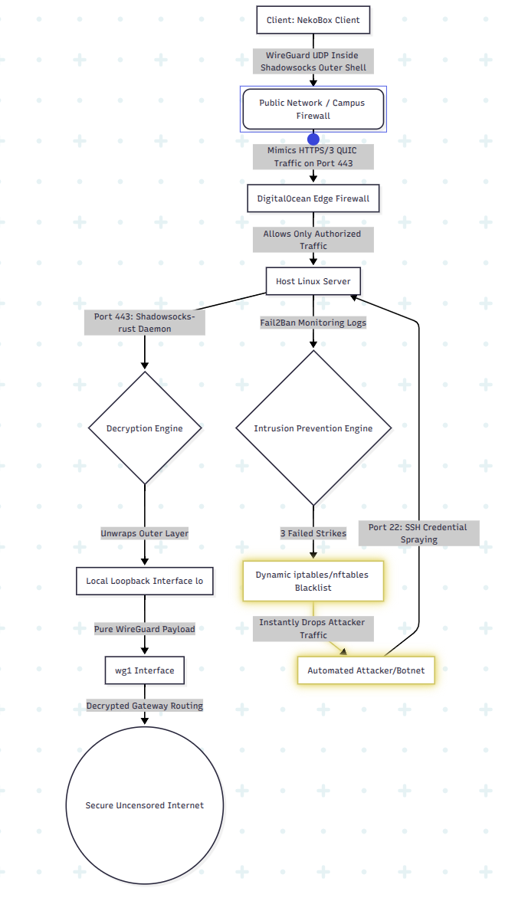
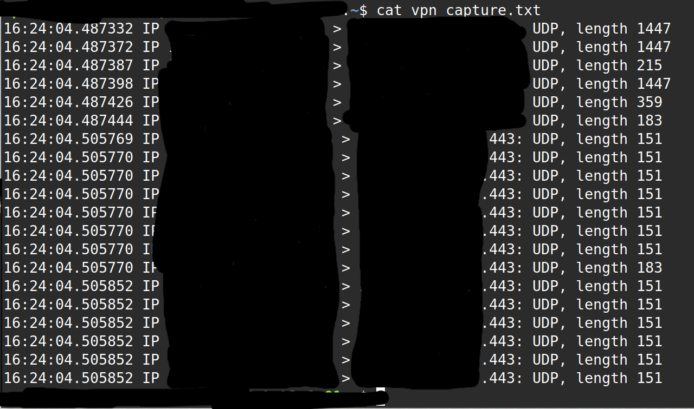
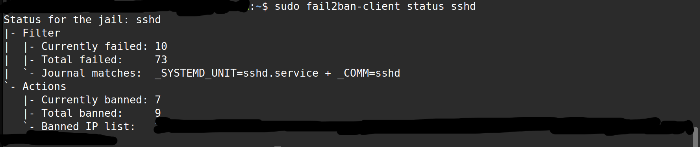

# DPI-Resistant Stealth VPN & Hardened Cloud Infrastructure

A production-grade, obfuscated network tunnel pipeline designed to bypass Deep Packet Inspection (DPI) firewalls using a WireGuard-over-Shadowsocks architecture, secured with automated host-level intrusion prevention.

---

## 1. Network Architecture & Packet Flow

Standard VPN protocols (like raw WireGuard or OpenVPN) are easy for modern firewalls to detect because they have highly predictable packet handshakes and headers. Deep Packet Inspection (DPI) engines used by corporate networks, ISPs, and universities can easily fingerprint and block this traffic.

This project solves that problem by building a multi-layer proxy pipeline. It wraps the encrypted WireGuard UDP packets inside an obfuscated Shadowsocks-rust AEAD cryptographic layer. This transforms your VPN traffic layout so it completely mimics standard, un-fingerprintable HTTPS/3 (QUIC) web traffic traveling over Port 443.

The entire end-to-end routing topology and security boundaries are mapped below:



---

## 2. Core Features & Technical Stack

* **Operating System:** Linux (Ubuntu 24.04 LTS) deployed on a virtual private cloud instance.
* **Layer 3 Tunneling:** WireGuard handling point-to-point secure network encapsulation.
* **Obfuscation Layer:** Shadowsocks-rust providing Authenticated Encryption with Associated Data (AEAD) to neutralize DPI filtering patterns.
* **Intrusion Prevention:** Fail2Ban automated daemon tracking system log streams to catch brute-force network scanners.
* **Persistence & Automation:** Native Linux systemd service integration ensuring the entire stack safely recovers automatically across system reboots or infrastructure power cycles.

---

## 3. Deep Packet Inspection Mitigation & Verification

To verify that the proxy tunnel hides the traffic fingerprint correctly without leaking raw packet signatures, network interfaces are actively analyzed. By executing a live packet capture on the active network interface, we can monitor the incoming data packets. 

Instead of showing predictable VPN handshake flags, the stream logs purely as high-entropy, randomized data payloads masking inside standard Port 443 web traffic channels. The raw hex/ASCII verification capture can be seen below:



---

## 4. Host Hardening & Perimeter Security

Exposing any server to the public internet makes it an immediate target for automated botnets executing credential-spraying or brute-force attacks. While the main stealth tunnel operates silently on Port 443, the server management interface (SSH on Port 22) requires active hardening.

This deployment implements Fail2Ban to mitigate this risk. It continuously monitors authentication logs for anomalous connection failures. If an IP address hits a 3-strike threshold, Fail2Ban instantly triggers a kernel firewall drop command, blacklisting the malicious attacker at the packet level before they can waste server CPU cycles or bandwidth.

Below is the live telemetry showing the active intrusion prevention system mitigating real-time attacks on the public deployment:



---

## 5. Automated Recovery & System Resilience

To eliminate manual maintenance overhead, all components are wrapped into custom systemd daemon configurations. This design pattern ensures that if the host cloud hardware undergoes an unexpected reboot or a kernel patch upgrade, the security policies and network routes restore autonomously in the exact sequence required. This guarantees high availability, persistent obfuscation, and reliable uptime without requiring administrative manual hookups after a crash.

---

## 6. User Reference & Verification Commands

Use the following commands directly on your server terminal to manage, monitor, and verify the infrastructure components.

### Deep Packet Analysis
Run a live packet sniffer on the server to inspect incoming encrypted UDP traffic moving through the obfuscated pipeline:
```bash
sudo tcpdump -i any udp port 443 -c 10
